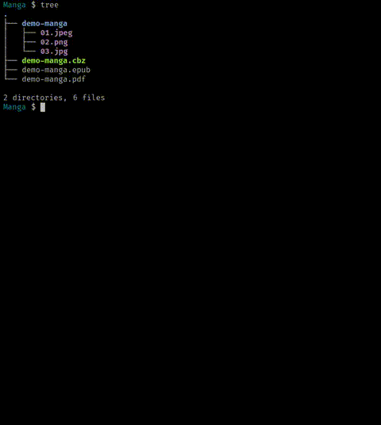

<div align="center">

# comicread 📖


`comicread` is a lightweight terminal reader for manga, comics, and other
image-first books. Written in Go, it opens CBZ, image-based PDF and EPUB files,
or directories of images, and lets you read them without leaving the terminal.




When the terminal supports it, pages are displayed as images through the Kitty,
Sixel, or iTerm2 graphics protocols. ASCII and Braille-dot renderers provide a
usable fallback in ordinary UTF-8 terminals. The interface stays deliberately
small: open a chapter, turn pages with the keyboard, and focus on reading.

</div>

## Features 💫

- Runs on **Linux**, **macOS**, and **Windows**.
- **Fast** and lightweight — a single **standalone binary**, no external libraries to install.
- **Native** application written in Go — no JavaScript, no Node.js required.
- Reads **CBZ**, image-based **PDF** and **EPUB** files, and image directories.
- Renders pages via **Kitty**, **Sixel**, or **iTerm2**, with ASCII/Braille-dot fallback in plain UTF-8 terminals.
- Saves **bookmarks** and resumes each chapter at its **last-opened page**.
- Supports **single**, **spread** (LTR/RTL), and **overlapping-page** views.
- Offers **keyboard navigation**, **zoom/scroll**, help, and a **file picker**.
- Localised in **15+ languages**.

## Installation

### Linux and macOS

```sh
curl -fsSL https://raw.githubusercontent.com/arimatakao/comicread/main/install.sh | bash
```

<details>
<summary>Manual installation or running</summary>

Download the archive for your operating system and architecture from the [latest release](https://github.com/arimatakao/comicread/releases/latest), then extract it.

On Linux or macOS:

```sh
tar -xzf comicread_*_linux_*.tar.gz # use *_darwin_* on macOS
./comicread /path/to/file.pdf # or file.cbz / file.epub
```

Move the extracted executable to a directory in your `PATH` to install it manually.

</details>

### Windows

```powershell
powershell -ExecutionPolicy Bypass -Command "iwr -useb https://raw.githubusercontent.com/arimatakao/comicread/main/install.ps1 | iex"
```


<details>
<summary>Manual installation or running</summary>

On Windows:

```powershell
Expand-Archive .\comicread_*_windows_*.zip -DestinationPath .\comicread
.\comicread\comicread.exe C:\path\to\file.pdf # or file.cbz / file.epub
```

Move the extracted executable to a directory in your `PATH` to install it manually.

</details>

### Installer language

The Linux/macOS and Windows installers automatically use the system language for their prompts and status messages. Supported languages are English, Ukrainian, Polish, German, French, Spanish, Czech, Romanian, Italian, Korean, Japanese, Indonesian, Hindi, Greek, Turkish, Kazakh, and Georgian. Unsupported languages fall back to English.

### Go

Requires Go 1.26.5 or newer:

```sh
go install github.com/arimatakao/comicread@latest
```


## Terminal compatibility

`kitty`, `sixel`, and `iterm2` render raster images. `ascii` and `dots` are
text-art fallbacks: they need ANSI cursor control and colour (true colour is
recommended); `dots` also needs Unicode Braille support. The latter two
therefore work in virtually every current UTF-8 terminal, including terminals
without an image protocol.

| Terminal | `kitty` | `sixel` | `iterm2` | `ascii` | `dots` | Notes |
| --- | :---: | :---: | :---: | :---: | :---: | --- |
| Any current ANSI/UTF-8 terminal | - | - | - | X | X | Fallback modes; use `ascii` if Braille glyphs are unavailable. |
| [Alacritty](https://github.com/alacritty/alacritty) | - | - | - | X | X | No support for these image protocols in the standard build. |
| [Bobcat](https://github.com/ismail-yilmaz/Bobcat) | - | X | - | X | X | Cross-platform (incl. Windows); natively supports SIXEL. |
| [Cmder](https://github.com/cmderdev/cmder) | - | - | - | X | X | Built on the ConEmu console; inherits its lack of SIXEL/Kitty support. |
| [ConEmu](https://conemu.github.io/) | - | - | - | X | X | No SIXEL or Kitty graphics protocol support. |
| [Contour](https://contour-terminal.org/configuration/) | - | X | - | X | X | |
| [DomTerm](https://domterm.org/Features.html) | - | X | - | X | X | |
| [foot](https://codeberg.org/dnkl/foot) | - | X | - | X | X | |
| [Ghostty](https://ghostty.org/docs/features) | X | - | - | X | X | Kitty graphics protocol. |
| [GNOME Console](https://apps.gnome.org/Console/) | - | - | - | X | X | VTE-based; its optional SIXEL support is disabled by default. |
| [GNOME Terminal](https://gitlab.gnome.org/GNOME/gnome-terminal) | - | - | - | X | X | VTE-based; its optional SIXEL support is disabled by default. |
| [Guake](https://github.com/Guake/guake) | - | - | - | X | X | VTE-based drop-down terminal; SIXEL is disabled by default. |
| [Hyper](https://hyper.is/) | - | - | X | X | X | Electron-based terminal; supports the iTerm2 inline image protocol only. |
| [iTerm2](https://iterm2.com/3.5/documentation-images.html) | X | X | X | X | X | Supports all three; its [release notes](https://iterm2.com/downloads.html?cve=title) document SIXEL and Kitty support. |
| [Kitty](https://sw.kovidgoyal.net/kitty/) | X | - | - | X | X | Native implementation of the Kitty graphics protocol. |
| [Konsole](https://konsole.kde.org/) | X | X | X | X | X | iTerm2 support is available since 22.04; animated images are limited. |
| [LXTerminal](https://github.com/lxde/lxterminal) | - | - | - | X | X | VTE-based; its optional SIXEL support is disabled by default. |
| [MATE Terminal](https://wiki.mate-desktop.org/mate-desktop/applications/mate-terminal/) | - | - | - | X | X | Standard MATE terminal; no image protocol support. |
| [mintty](https://mintty.github.io/) / wsltty | - | X | X | X | X | Windows/Cygwin terminal and its WSL variant. |
| [mlterm](https://mlterm.sourceforge.net/) | - | X | X | X | X | `iterm2` requires a build with `SUPPORT_ITERM2_OSC1337`. |
| [MobaXterm](https://mobaxterm.mobatek.net/) | - | - | - | X | X | No SIXEL or Kitty graphics protocol support found in its release notes. |
| [Ptyxis](https://gitlab.gnome.org/chergert/ptyxis) | - | - | - | X | X | GNOME container-focused terminal; no raster image protocol support yet. |
| [PuTTY](https://www.chiark.greenend.org.uk/~sgtatham/putty/) | - | - | - | X | X | No SIXEL or Kitty graphics protocol support. |
| [QTerminal](https://github.com/lxqt/qterminal) | - | - | - | X | X | LXQt terminal based on qtermwidget; no SIXEL or Kitty support yet. |
| [Rio](https://rioterm.com/) | X | X | X | X | X | Supports Kitty, Sixel, and iTerm2 image protocols. |
| [st](https://st.suckless.org/) with a graphics patch | X | - | - | X | X | Requires a Kitty-graphics implementation patch. |
| [SyncTERM](https://www.syncterm.net/) | - | X | - | X | X | |
| [Tabby](https://github.com/Eugeny/tabby) | - | X | - | X | X | SIXEL only; Kitty graphics protocol support is still an open request. |
| [Terminator](https://gnome-terminator.readthedocs.io/) | - | - | - | X | X | VTE-based; its optional SIXEL support is disabled by default. |
| [Tilix](https://github.com/gnunn1/tilix) | - | - | - | X | X | VTE-based; its optional SIXEL support is disabled by default. |
| [Warp](https://www.warp.dev/) | X | - | - | X | X | Implements the Kitty graphics protocol. |
| [wayst](https://github.com/91861/wayst) | X | X | - | X | X | Kitty graphics protocol; SIXEL support is experimental. |
| [WezTerm](https://wezterm.org/features.html) | X | X | X | X | X | Enable `enable_kitty_graphics=true` for `kitty`; Sixel is experimental. |
| [Windows Terminal](https://github.com/microsoft/terminal) | - | X | - | X | X | SIXEL support added in 1.22; no Kitty graphics protocol support yet. |
| [Xfce Terminal](https://docs.xfce.org/apps/xfce4-terminal/start) | - | - | - | X | X | VTE-based; its optional SIXEL support is disabled by default. |
| [xterm](https://invisible-island.net/xterm/ctlseqs/ctlseqs.html) | - | X | - | X | X | Must be built with SIXEL and configured as a DEC graphics terminal. |
| [xterm.js](https://xtermjs.org/) host | X | X | X | X | X | Requires the image add-on; its Kitty implementation is partial. |
| [yaft](https://github.com/uobikiemukot/yaft) | - | X | - | X | X | Linux framebuffer terminal. |
| [Yakuake](https://apps.kde.org/yakuake/) | X | X | X | X | X | KDE drop-down terminal built on the Konsole KPart; inherits its graphics support. |

## Basic usage

```sh
# Open the file picker and choose a file.
comicread

# Show the command help.
comicread --help

# Print the active environment settings, version, or available updates.
comicread --env
comicread --version
comicread --update

# Open the interactive file picker in the current directory.
comicread

# Open the interactive file picker in a specific directory.
comicread --open /path/to/manga

# Ignore COMICREAD_DIR and open the file picker in the current directory.
comicread --open

# Read a CBZ archive.
comicread /path/to/file.cbz

# Read an image-based PDF or EPUB.
comicread /path/to/file.pdf
comicread /path/to/file.epub

# Read images from a directory.
comicread /path/to/image-directory

# Use the Kitty, Sixel, or iTerm2 image protocol explicitly.
comicread --graphics kitty /path/to/file.cbz
comicread --graphics sixel /path/to/file.cbz
comicread --graphics iterm2 /path/to/file.cbz

# Use text-art renderers when the terminal has no image protocol.
comicread --graphics ascii /path/to/file.cbz
comicread --graphics dots /path/to/file.cbz

# Combine an explicit renderer with a right-to-left page layout.
comicread --graphics sixel --right-view /path/to/file.cbz

# Show page pairs left to right or right to left.
comicread --book-view /path/to/file.cbz
comicread --right-view /path/to/file.cbz

# Show overlapping page pairs left to right or right to left.
comicread --circle-view /path/to/file.cbz
comicread --right-circle-view /path/to/file.cbz

# Remove saved reading progress and bookmarks for a file or directory.
comicread --clear-journal /path/to/file.cbz
comicread --clear-journal /path/to/image-directory

# Add defaults to a shell configuration file, such as ~/.zshrc or ~/.bashrc.
export COMICREAD_GRAPHICS=sixel
export COMICREAD_VIEW=right-view
export COMICREAD_LANG=en
export COMICREAD_DIR=/path/to/manga

# Set the renderer default for this command.
COMICREAD_GRAPHICS=sixel comicread /path/to/file.cbz

# Set the default page layout for this command.
COMICREAD_VIEW=right-view comicread /path/to/file.cbz

# Run the interface in Ukrainian for this command.
COMICREAD_LANG=uk comicread /path/to/file.cbz

# Set the renderer, page layout, and interface language for one command.
COMICREAD_GRAPHICS=sixel COMICREAD_VIEW=right-view COMICREAD_LANG=uk comicread /path/to/file.cbz

# Open the file picker in a manga library.
COMICREAD_DIR=/path/to/manga comicread
```

Environment variables:

Add these to your shell configuration file (such as `.bashrc`, `.zshrc`, or `.profile`) to use the same defaults every time.

- `COMICREAD_GRAPHICS`: `auto`, `ascii`, `dots`, `kitty`, `sixel`, or `iterm2`.
- `COMICREAD_VIEW`: `book-view`, `right-view`, `circle-view`, or `right-circle-view`; leave unset for single-page view.
- `COMICREAD_LANG`: supported language codes are listed below.

  | Code | Language |
  | --- | --- |
  | `en` | English |
  | `uk` | Ukrainian |
  | `pl` | Polish |
  | `de` | German |
  | `fr` | French |
  | `es` | Spanish |
  | `cs` | Czech |
  | `ro` | Romanian |
  | `it` | Italian |
  | `ko` | Korean |
  | `ja` | Japanese |
  | `id` | Indonesian |
  | `hi` | Hindi |
  | `el` | Greek |
  | `tr` | Turkish |
  | `kk` | Kazakh |
  | `ka` | Georgian |
  | `hu` | Hungarian |
  | `sv` | Swedish |
  | `no` | Norwegian |
  | `da` | Danish |
  | `fi` | Finnish |

### Controls

#### Reader

| Keys | Action |
| --- | --- |
| `right`, `l`, `space`, `j`, `PageDown` | Next page |
| `left`, `h`, `backspace`, `k`, `PageUp` | Previous page |
| `+`, `-` | Zoom in or out |
| `up`, `down` | Scroll a zoomed page |
| `b` | Add or remove a bookmark on the current page |
| `v` then `left` or `right` | Go to the previous or next bookmark |
| `c` then `v` | Open the bookmark list |
| `g` then digits, `Enter` | Go to a page number (`Esc` cancels) |
| `?` | Open or close help |
| `q`, `Esc`, `Ctrl+C` | Quit |

#### Bookmark list

| Keys | Action |
| --- | --- |
| `up`, `down` | Move selection |
| `Enter` | Open the selected bookmark |
| `q`, `Esc` | Close the list |

#### File picker

| Keys | Action |
| --- | --- |
| `up`, `k`, `down`, `j` | Move selection |
| `left`, `h` | Open the parent directory |
| `right`, `l` | Enter the selected directory |
| `Enter` | Open the selected file |
| `s` | Open the selected directory |
| `o` | Enter a directory path |
| `q`, `Esc`, `Ctrl+C` | Quit |

## Dependency licenses

The main direct dependencies are distributed under permissive licenses:

- [Bubble Tea v2](https://github.com/charmbracelet/bubbletea) — MIT
- [rasterm](https://github.com/BourgeoisBear/rasterm) — MIT
- [comicfile](https://github.com/arimatakao/comicfile) — MIT
- [ASCIIimage v2](https://github.com/fandasy/ASCIIimage) — MIT
- [dots](https://github.com/imjasonh/dots) — Apache License 2.0
- [golang.org/x/image](https://pkg.go.dev/golang.org/x/image) — BSD-style (Go Authors)

See the `LICENSE` file bundled with each dependency version in the Go module
cache for its full license text. Transitive dependencies may have their own
license terms.
